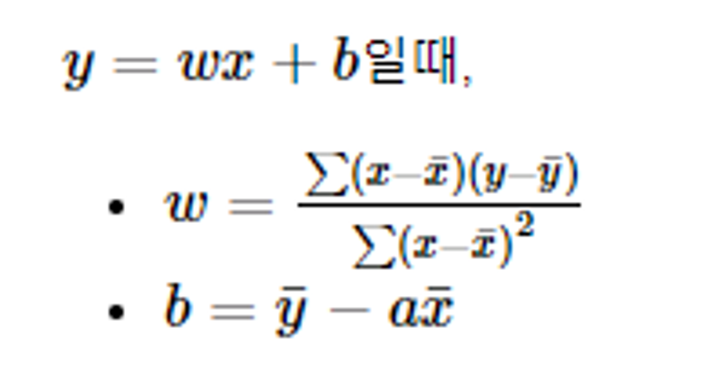

# Torch_Memo

- **detach().numpy()**
    - .detach()  :  graph에서 분리한 새로운 tensor를 리.  연산 기록으로부터 분리한 tensor을 반환
    - .numpy() : tensor를 numpy로 변환
<br/>
- **zero_grad()** 를 항상 backward() 전에 해야하는가
    - zero_grad() :  optimizer에 연결된 parameter들의 gradient를 0으로 만든다.
    Pytorch에서는 gradients값들을 추후에 backward를 해줄때 계속 더해주기 때문에, 우리는 항상 backpropagation을 하기전에 gradients를 zero로 만들어주고 시작을 해야한다.
    
    - 변화도를 0으로, 역전파 수행, 가중치 갱신
    optim.zero_grad()  #모델 매개변수의 변화도를 재설정
    loss.backward() #예측 손실(prediction loss)을 역전파, 각 매개변수에 대한 손실의 변화도를 저장
    optim.step()  #수집된 변화도로 매개변수를 조정
    

<br/>

- **OLS, 최소제곱법(Ordinary Least Square;OLS)**
    - 근사 해와 실제 해의 오차의 제곱의 합이 최소가 되는 계수 계산
    - outlier에 취약, 특징 변수와 샘플 건수에 비례해서 계산 비용이 큼
    
<br/>

- **Learning Rate Scheduler**
    - ref. https://sanghyu.tistory.com/113
<br/>

- **PyTorch  L1-L2**
    - L1 regularity : PyTorch 에서 L1 regularity 를 부여하기 위해서는 model 의 parameter 로부터 L1 norm 을 계산하여 이를 cost 에 더하면 됩니다. 단, Parameters 가 아닌 Tensor 를 더하면 안됩니다.
    L1 regularity 를 부여해도 coefficient 가 0 이 되지 않을 수 있습니다. Coefficient 의 절대값이 매우 작아지면 이를 0 으로 취급해도 됩니다.
    L1 norm 의 크기가 유지되면서 L2 norm 의 크기가 증가한다면, elements 중 절대값이 0 에 가까워지는 elements 의 개수가 늘어나고 있음을 의미합니다.
    - L2 : adam 사용
    <br/>

- **[nn.Sequential] vs [nn.ModuleList]**
    - [nn.Sequential]
    안에 들어가는 모듈들을 연결해주고, 하나의 뉴럴넷으로 정의
    자동으로 연결되므로, input x에 넣어주면 주르륵 통과해서 output이 나옴
    나열된 모듈들이 output shape와 input shape가 일치해야 함
    
    - [nn.ModuleList]
    개별적으로 모듈들이 담겨있는 리스트, 연결관계가 정의되지 않음
    forward함수에서 연결관계를 정의해야 함
    

---

- np array → torch
    - b = torch.from_numpy(a)
<br/>

- torch.Tensor
    - .requires_grad  : 모든 연산 추적
    - .grad 에 tensor에 대한 gradient 누적
        - 계산 끝나고 .backward() 를 호출 하면, 자동으로 모든 gradient 계산 가능
    - .detach() : tensor 기록 추적 중지,
    - with torch.no.grad(): 로 코드 블럭 - 기록 추적 방지 (test시 사용 가능)
    - Function
<br/>

- autograd.Function
<br/>

- **torch.nn**
    - net = Net()
    - net.parameters()    # 학습 가능한 매개변수
    - **torch.nn은 미니-배치(mini-batches)만을 지원 ??**
<br/>

- torch.optim
    - optimizer.zero_grad()  # 버퍼를 수동으로 0으로 설정,
    - optimizer.step()  # 갱신하기
    
- torchvision의 데이터셋 출력(output)은 [0, 1] 범위를 갖는 PILImage
    - [-1, 1] 범위로 정규화된 Tensor로 변환  **`transforms.ToTensor()`**
    - 
<br/>
<br/>

- **tensorboard**
    - https://tutorials.pytorch.kr/recipes/recipes/tensorboard_with_pytorch.html
    - `torchvision` 패키지에 포함
    - `SummaryWriter` **인스턴스를 생성**
        - Writer는 기본적으로 `./runs/` 디렉터리에 출력
            
            ```python
            from torch.utils.tensorboard import SummaryWriter
            writer = SummaryWriter()
            ```
            
    - **스칼라(scalar) 기록하기**
        - `add_scalar(tag, scalar_value, global_step=None, walltime=None)`  **사용**
        
        ```python
        loss = criterion(y1, y)
        writer.add_scalar("Loss/train", loss, epoch)
        ```
        
    - `writer.flush()`
        - 모든 보류중인(pending) 이벤트가 디스크에 기록되었는지 확인
    - `writer.close()`
    
    - **tensorboard 실행**
        - `tensorboard --logdir=runs`
        - 제공하는 URL로 이동하거나 http://localhost:6006/ 로 이동
<br/>

---
- **GPU 할당**
    - **CUDA_VISIBLE_DEVICES**  : CUDA가 볼 수 있는 GPU 제한
        
        ```python
        CUDA_VISIBLE_DEVICES=2,3 python train.py
        ```
        
        ```python
        os.environ["CUDA_DEVICE_ORDER"]="PCI_BUS_ID"  # Arrange GPU devices starting from 0
        os.environ["CUDA_VISIBLE_DEVICES"]= "2,3"  # Set the GPUs 2 and 3 to use
        ```
    <br/>
    
    - **GPU 할당 확인**
        - torch.cuda.is_available(): cuda가 사용 가능하면 true를 반환, device에 cuda를 설정
        - torch.cuda.current_device(): 현재 cuda가 사용할 GPU
        - torch.cuda.device_count(): 현재 cuda가 사용할 GPU 개수
            
            ```python
            device = torch.device("cuda" if torch.cuda.is_available() else "cpu")
            
            print('Device:', device)
            print('Current cuda device:', torch.cuda.current_device())
            print('Count of using GPUs:', torch.cuda.device_count())
            ```
    <br/>   
    
    - **model을 gpu에 연결하여 실행**
        
        ```python
        net = ResNet50().to(device)
        ```
        
        ```python
        _net = ResNet50().cuda()
        net = nn.DataParallel(_net).to(device)
        ```
      <br/>
---  
- **Accelerator**
    
    enables the same PyTorch code to be run across any distributed configuration by adding just four lines of code!
---